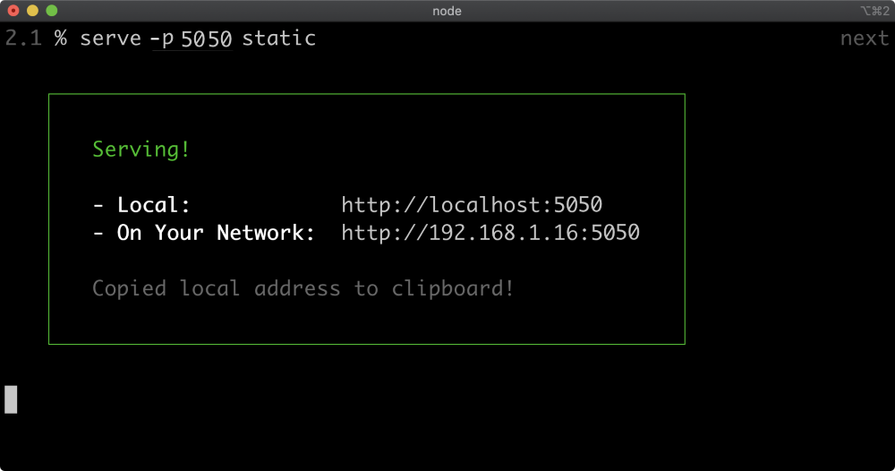
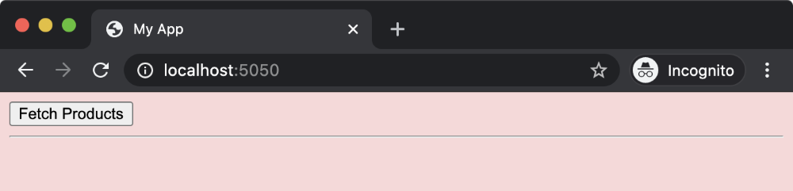
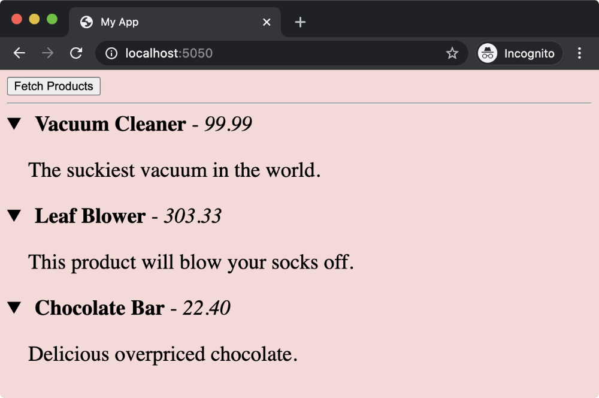

# Quick File Server (1)
To serve files from a folder, we can use the serve package. Start by installing it using the following command in your terminal:

```
$ npm install serve
```
Once installed, complete the steps as they are described throughout this section.

The first step is to create a new folder called static in your project directory. You can do this by running the following command:

```
$ mkdir static
```
Feel free to use any preferred method to create the static folder.


# Quick File Server (2)
The second step is to create two files inside the static folder labeled index.html and app.js. Place the respective code into each file as shown below:

>index.html Folder:

```
<html>
  <head>
    <title>My App</title>
    <script type="module" src="app.js"></script>
    <style>body { background: #fad8d8 }</style>
  </head>
  <body>
    <nav>
      <button id="fetch">Fetch Products</button>
    </nav>
    <hr>
    <div id="products"></div>
    <template id="item">
      <style>
        details { font-size: 1.5em; }
        summary { cursor: pointer; }
        p { text-indent: 1.5rem; }
      </style>
       <details>
        <summary>
          <strong>
            <slot name="name"></slot>
          </strong> - <em><slot name="rrp"></slot></em>
        </summary>
        <p><slot name="info"></slot></p>
      </details>
    </template>
  </body>
</html>
```
>app.js Folder:

```
const mockData = [
  {id: 'A1', name: 'Vacuum Cleaner', rrp: '99.99', info: 'The most powerful vacuum in the world.'},
  {id: 'A2', name: 'Leaf Blower', rrp: '303.33', info: 'This product will blow your socks off.'},
  {id: 'B1', name: 'Chocolate Bar', rrp: '22.40', info: 'Deliciously overpriced chocolate.'}
]
const populateProducts =() => {
  const products = document.querySelector('#products')
  products.innerHTML = ''
  for (const product of mockData) {
    const item = document.createElement('product-item')
    for (const key of ['name', 'rrp', 'info']) {
      const span = document.createElement('span')
      span.slot = key
      span.textContent = product[key]
      item.appendChild(span)
    }
    products.appendChild(item)
  }
}

document.querySelector('#fetch').addEventListener('click', async () => {
  await populateProducts()
})

 

customElements.define('product-item', class Item extends HTMLElement {
  constructor() {
    super()
    const itemTmpl = document.querySelector('#item').content.cloneNode(true)
    this.attachShadow({mode: 'open'}).appendChild(itemTmpl)
  }
})
```

# Quick File Server (3)
Next, navigate to the directory that contains the static folder within the terminal.

Then use the following command to start the file server:

```
$ npx serve -p 5050 static
```

This command will start the file server on port 5050 and serve the contents of the static folder:



>Terminal Output: serve -p 5050 static

Now, you can open your browser and navigate to http://localhost:5050. You should see the web page with the Fetch Products button.




Example of Fetch Products Button

Click the Fetch Products button to populate the web page with some data.

You can also expand these sections by clicking on them. Once all of the sections are expanded, it should look like the image below:



>Expanded Sections View in App

The data that generates the information in these elements is currently embedded in the client side code within app.js.

Feel free to customize the content of the index.html and app.js files according to your requirements.